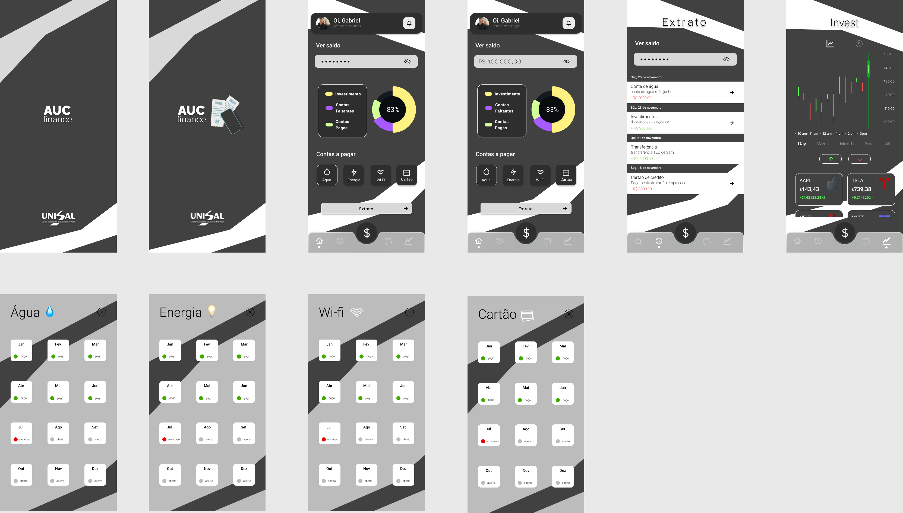

<h2  align="center"> Segunda Avaliação (A2) - 2o Semestre 💻 </h2>

<h3> Alunos:</h3>

-  Ana Clara Furlan Mazotti

-  Eloise Emiko Takami

-  Gabriel Dias

-  João Oliveira

-  Matheus Benini

-  Samuel Huss

 ## Etapa 1 – Requisitos – Diagrama de Casos de Uso 
 - [Diagrama de casos de uso](https://github.com/samuelhuss/aucfinance/blob/main/diagrama%20de%20caso%20de%20uso.pdf)
 - [Requisitos](https://github.com/samuelhuss/aucfinance/blob/main/requisitos.pdf)

##	Etapa 2 – Gestão de Configuração de Software
 - [GitHub](https://github.com/samuelhuss/aucfinance)

##	Etapa 3 – Gestão ágil de projeto - SCRUM 
 - [Backlog e Sprint](https://github.com/users/samuelhuss/projects/2/views/2)
 - [Burndown chart](https://github.com/samuelhuss/aucfinance/blob/main/burndown.png)
 - [Tabela Burndown](https://github.com/samuelhuss/aucfinance/blob/main/burndown.xlsx)

##	Etapa 4 – Projeto 
 - [Diagrama de máquina de estado](https://github.com/samuelhuss/aucfinance/blob/main/diagrama_maquina_de_estado.pdf)

##	Etapa 5 – Interface
 - [Protótipo](https://www.figma.com/proto/hL1URmim9E3ErIqOUpwMHR/AUC-FInance?node-id=28%3A8&scaling=scale-down&page-id=0%3A1&starting-point-node-id=25%3A8)

 - [Telas]
 - 
 
 
## Etapa 6 – Teste 
 - [Plano de teste](https://github.com/samuelhuss/aucfinance/blob/main/testes.pdf)

 
Feito com ♥

